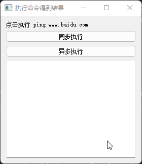

# QProcess

- 目录
  - [执行命令得到结果](#1执行命令得到结果)

## 1、执行命令得到结果
[运行 GetCmdResult.py](GetCmdResult.py)

`QProcess` 常用执行命令方式有以下几种：
1. `QProcess.execute('ping', ['www.baidu.com'])`：同步执行，返回值为进程退出码
2. `QProcess.startDetached('ping', ['www.baidu.com'], '工作路径')`：返回值为是否启动成功，该命令一般用于启动某个程序后就不管了
3. 通过构造`QProcess`对象，然后通过`QProcess.start()`启动进程，并分为同步和异步两种方式获取输出

示例代码为第3种方式：

1. 通过`setProcessChannelMode(QProcess.MergedChannels)`合并标准输出和错误输出
2. `waitForFinished`为同步方式，然后调用`readAll`读取所有输出
3. 也可以绑定`finished`信号，然后通过`readAll`读取所有输出

